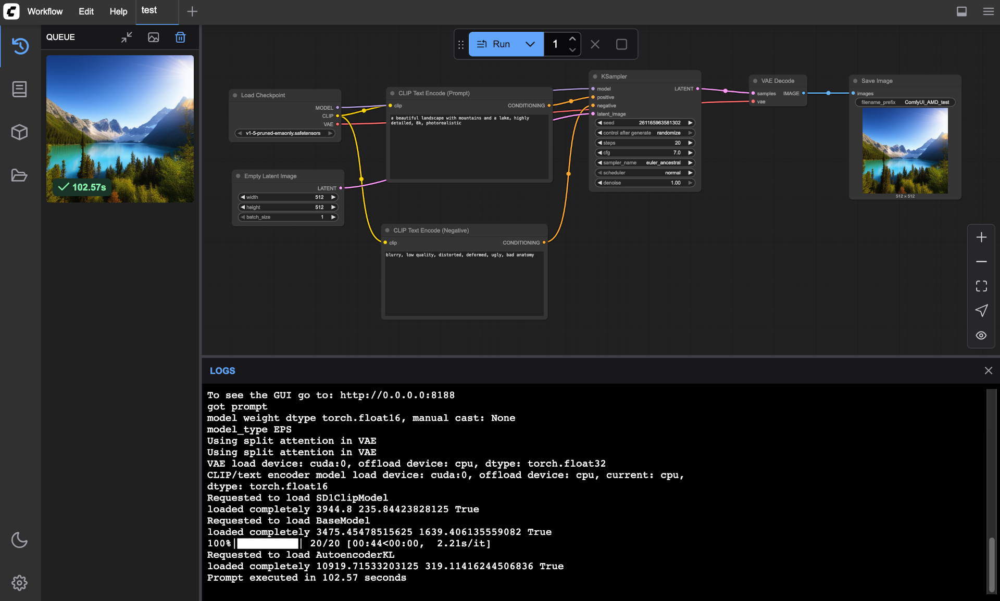

# ComfyUI ROCm Docker Image

🔥 **ComfyUI with AMD ROCm support** - Run ComfyUI on AMD GPUs with optimized ROCm-compatible dependencies.

[](https://hub.docker.com/r/corundex/comfyui-rocm) [](https://rocm.docs.amd.com/) [](https://www.amd.com/en/products/graphics/desktops/radeon.html)


*ComfyUI running on AMD ROCm with sample workflow and generated landscape image*

## 📋 Version Information

- **Base Image**: `rocm/pytorch:rocm10.0_ubuntu26.04_py3.14_pytorch_release_2.13.0`
- **Python**: 3.14.0
- **PyTorch**: 2.13.0+git
- **ROCm**: 10.0
- **ComfyUI**: latest

## ✨ Key Features

- 🎨 **Node-based AI workflow** - Visual interface for creating complex AI pipelines
- 🔥 **AMD ROCm optimized** - Native AMD GPU acceleration with ROCm 6.4+
- 📦 **Smart model management** - Automatic downloads with configurable model sets
- 🧪 **Tested compatibility** - All dependencies verified on real AMD hardware
- 🎯 **Ready to use** - Pre-configured with sample workflows
- 💾 **Persistent storage** - Models and outputs preserved across restarts


## 🚀 Quick Start

```bash
# Pull and run ComfyUI with ROCm support
docker run -d \
  --device=/dev/kfd \
  --device=/dev/dri \
  --group-add=video \
  -p 8188:8188 \
  -v $(pwd)/models:/workspace/ComfyUI/models \
  -v $(pwd)/output:/workspace/ComfyUI/output \
  corundex/comfyui-rocm:latest
```

Access ComfyUI at: **http://localhost:8188**

## 📋 Requirements

| Component  | Requirement                                |
| ---------- | ------------------------------------------ |
| **GPU**    | AMD RX 6000/7000/9000 series with ROCm support |
| **VRAM**   | 8GB minimum (16GB+ recommended)            |
| **OS**     | Linux (Ubuntu 26.04 recommended)          |
| **Docker** | Latest version with GPU support            |
| **Kernel** | 5.4+ with `amdgpu` module loaded             |

## 🔧 Setup Instructions

### 1. Verify AMD GPU Support

**The container includes all ROCm userspace libraries.** The host only needs kernel-level AMD GPU support, which is included in all modern Linux kernels.

```bash
# Check if amdgpu is loaded (most modern distros have it by default)
lsmod | grep amdgpu
```

If not loaded, load it:
```bash
sudo modprobe amdgpu
```

Add your user to the required groups:
```bash
sudo usermod -a -G render,video $USER
# Log out and back in for group changes to take effect
```

Verify device nodes exist:
```bash
ls -l /dev/kfd /dev/dri
```

> **Note:** You do NOT need to install ROCm userspace packages (`rocm-dkms`, `rocm-smi`, etc.) on the host. The Docker container includes all necessary ROCm libraries. The `rocm-dkms` package is only needed if your GPU isn't supported by your distribution's mainline kernel.

### 2. Verify GPU Access (optional)

If you want to verify ROCm works on your system:
```bash
rocm-smi  # Shows your AMD GPU(s) — optional, for diagnostics only
```

### 3. Run ComfyUI
```bash
docker run -d \
  --name comfyui-rocm \
  --device=/dev/kfd --device=/dev/dri --group-add=video \
  -p 8188:8188 \
  -v ./models:/workspace/ComfyUI/models \
  -v ./output:/workspace/ComfyUI/output \
  corundex/comfyui-rocm:latest
```

## 🎛️ Model Management

Control model downloading with the `MODEL_DOWNLOAD` environment variable:

| Mode             | Description                   | Models Included                                       |
| ---------------- | ----------------------------- | ----------------------------------------------------- |
| `default`        | Essential starter (4GB)       | SD 1.5                                                |
| `common`         | Comprehensive set (~30GB)     | SD 1.5, SDXL, ControlNets, upscalers, VAE, embeddings |
| `realistic`      | Photo-realistic models (~8GB) | Realistic Vision, DreamShaper, VAE                    |
| `photorealistic` | SDXL realistic (~12GB)        | Juggernaut XL, RealVisXL                              |
| `artistic`       | Creative/stylized (~2GB)      | Deliberate v2                                         |
| `all`            | Everything (~100GB)           | All model sets combined                               |
| `none`           | Skip downloads                | Use existing models only                              |

### Usage Examples

```bash
# Default models (SD 1.5)
docker run -d --device=/dev/kfd --device=/dev/dri --group-add=video \
  -p 8188:8188 -v ./models:/workspace/ComfyUI/models \
  corundex/comfyui-rocm:latest

# All models (~100GB download)
docker run -d --device=/dev/kfd --device=/dev/dri --group-add=video \
  -p 8188:8188 -e MODEL_DOWNLOAD=all \
  -v ./models:/workspace/ComfyUI/models \
  corundex/comfyui-rocm:latest

# Use existing models only
docker run -d --device=/dev/kfd --device=/dev/dri --group-add=video \
  -p 8188:8188 -e MODEL_DOWNLOAD=none \
  -v ./models:/workspace/ComfyUI/models \
  corundex/comfyui-rocm:latest
```

## 🐳 Docker Compose

```yaml
services:
  comfyui-rocm:
    image: corundex/comfyui-rocm:latest
    container_name: comfyui-rocm
    devices:
      - /dev/kfd:/dev/kfd
      - /dev/dri:/dev/dri
    group_add:
      - video
    ports:
      - "8188:8188"
    volumes:
      - ./data/models:/workspace/ComfyUI/models
      - ./data/output:/workspace/ComfyUI/output
      - ./data/input:/workspace/ComfyUI/input
      - ./data/custom_nodes:/workspace/ComfyUI/custom_nodes
      - ./data/user:/workspace/ComfyUI/user
    environment:
      - MODEL_DOWNLOAD=default
      - HIP_VISIBLE_DEVICES=0
      - CUDA_VISIBLE_DEVICES=""
    restart: unless-stopped
```

Run with: `docker compose up -d`

## ⚡ Performance & Hardware

### Tested Hardware
- **AMD Radeon RX 9060 XT** (16GB VRAM) ✅

### Performance Metrics
- **Generation Time**: ~30-60s for 512x512 images
- **VRAM Usage**: 4-8GB for basic operations
- **Model Loading**: ~30-60s first time, cached afterward
- **Batch Processing**: Multiple images supported

### Tips
- Mount persistent volumes to avoid re-downloading models
- Start with `default` models, upgrade to larger sets as needed
- Use fast SSD storage for optimal performance

## 🔍 Troubleshooting

| Issue                     | Solution                                                                                                           |
| ------------------------- | ------------------------------------------------------------------------------------------------------------------ |
| **Container won't start** | Check kernel modules: `lsmod | grep amdgpu` |
| **No GPU detected**       | Verify container GPU access: `docker exec comfyui-rocm python -c "import torch; print(torch.cuda.is_available())"` |
| **Model download fails**  | Check internet connection, disk space, and logs                                                                    |
| **Out of memory**         | Reduce batch size, use smaller models, ensure 8GB+ VRAM                                                            |
| **Models not found**      | Verify downloads completed and file permissions                                                                    |

## 📄 License & Credits

This project is licensed under GPL-3.0. See the [LICENSE](LICENSE) file for details.

### Third-Party Components
- **ComfyUI**: GPL-3.0 - [ComfyUI](https://github.com/comfyanonymous/ComfyUI)
- **PyTorch**: BSD 3-Clause - [PyTorch](https://pytorch.org/)
- **ROCm**: Various OSS licenses - [AMD ROCm](https://rocm.docs.amd.com/)

**Acknowledgments:**
- [ComfyUI](https://github.com/comfyanonymous/ComfyUI) - Node-based AI workflow interface
- [AMD ROCm](https://rocm.docs.amd.com/) - Open source GPU computing platform
- ROCm community for AMD GPU AI support

---

🔗 **Links:** [Docker Hub](https://hub.docker.com/r/corundex/comfyui-rocm) | [GitHub](https://github.com/corundex/comfyui-rocm) | [ComfyUI](https://github.com/comfyanonymous/ComfyUI)
